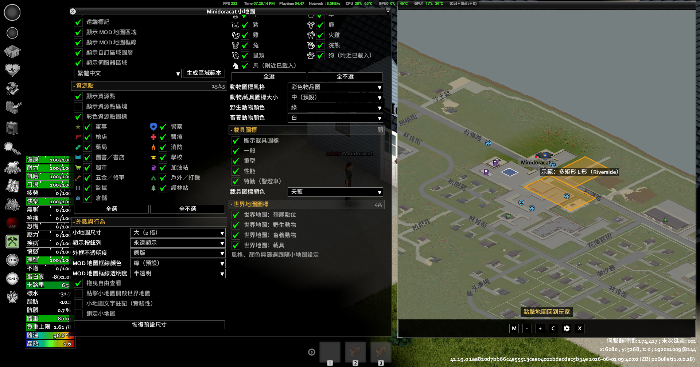
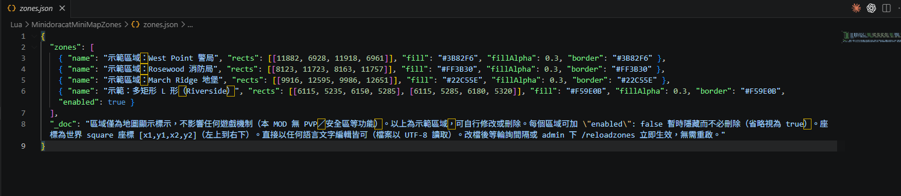

# MinidoracatMiniMapZonesFor42

[Minidoracat MiniMap for B42](https://github.com/Minidoracat) 主 MOD 的**伺服器自訂區域 addon**：
伺服器端一份 `zones.json` 定義任意矩形區域，主 MOD 在小地圖與世界地圖上畫出半透明填色＋
框線＋置中名稱標籤。純資料 MOD——繪製、開關、統一設定視窗全在主 MOD
（`registerZoneProvider` / `registerZoneAction` API），本包只負責「資料從哪來」。

- **需要主 MOD**：`MinidoracatMiniMapFor42` **42.19.0-0.8.0 以上**（`require=` 確保
  存在與載入順序；版本過舊時本包版本守衛安靜降級，不 crash、不影響主 MOD 其餘功能）
- **本包版本**：`42.20.1-0.3.0`（**需 Build 42.20.1 以上**——42.20.0 的 Lua 寫檔白名單
  不含 `.json`，故 `versionMin=42.20.1`；單人／多人皆可用）

## 特色

- **伺服器自訂區域**：`Zomboid/Lua/MinidoracatMiniMapZones/zones.json` 定義區域，
  外部程式可直接寫入（活動範圍工具、重置區標記工具等）；伺服器驗證後即時廣播全體，
  輪詢間隔 sandbox 可調（`PollIntervalSeconds`，預設 60 秒）；新進玩家進服即同步全量
- **檔名改回 `zones.json`（0.3.0）**：遊戲 42.20.0 曾把 `.json` 排除在 Lua 寫檔副檔名
  白名單之外（0.2.0 因此暫改 `zones.txt`），**42.20.1 已把 `.json` 加回**，故正典檔改回
  `zones.json`。0.2.0 的 `zones.txt` 首次啟動自動原樣搬入 `zones.json`（一次性，marker
  檔記錄；覆寫前若 `zones.json` 已有內容，會先原樣備份為 `zones.premigrate.bak.json`）。
  之後執行期刪 `zones.json`＝清空區域、關服期間刪除＝下次啟動重生示範範本，兩者皆不會
  從殘留的 `zones.txt` 復活。外部程式請改寫 `zones.json`。
  > 升級提醒：本包**不會**去猜磁碟上既有的 `zones.json` 是不是 42.19 時代的舊檔（那種推論
  > 會誤刪真實資料）。若你在 0.2.0 期間刪過 `zones.txt` 來清空區域、且機器上還留著更早的
  > `zones.json`，升級後可能看到舊區域重新出現——直接編輯或清空 `zones.json` 即可。
- **純地圖顯示**：區域僅為視覺標示，不含 PVP／安全區等任何遊戲機制
- **自動示範範本**：首次啟動自動生成四個示範區域（含多矩形 L 形），文字依伺服器語系
  （繁中／簡中／英／日）；執行期檔案被刪自動重生空範本
- **生成區域範本按鈕**：統一設定視窗語言下拉＋按鈕；確認視窗防誤按、現有檔先備份為
  `zones.<時間戳>.bak.json` 再覆寫；伺服器上需「管理模組」權限
- **`/reloadzones`**：管理員聊天指令，立即強制重讀＋全體廣播（單機走本地重讀）
- **`enabled` 欄位**：`"enabled": false` 保留座標暫時隱藏，不必刪除
- **壞資料容錯**：錯誤條目跳過並記錄，不影響其他區域；上限：總數 ≤500、
  單區域 rects ≤64

## 截圖

| | |
|---|---|
|  |  |

## zones.json 格式

```json
{
  "zones": [
    {
      "name": "區域名稱（任意語言）",
      "rects": [[11882, 6928, 11918, 6961], [11918, 6961, 11950, 7000]],
      "fill": "#3B82F6",
      "fillAlpha": 0.3,
      "border": "#3B82F6",
      "borderAlpha": 0.9,
      "haloAlpha": 0.55,
      "category": "活動區",
      "enabled": true
    }
  ]
}
```

- `rects`：`[[x1,y1,x2,y2], ...]` 世界 square 座標（左上到右下，x2>x1、y2>y1），
  一個區域可含多個矩形
- `fill`／`border`：`"#RRGGBB"` 或 `[r, g, b]`；`fillAlpha`／`borderAlpha` 0–1
  （缺省 fill 為紅、`alpha` 別名亦通）
- `haloAlpha`：選填 0–1，區塊底下墊外擴暗色底（描邊效果、比框線便宜；0.4.0+，
  需主 MOD 0.14.0+）；與 border 可並存疊用
- `category`：選填字串，玩家端「自訂區域」設定區依實際類別動態生成逐類
  勾選篩選（主 MOD 0.14.0+）；類別名含逗號或 `-`／`nil` 保留字時不進勾選 UI
  （區域照常顯示）
- `enabled`：選填布林，省略＝`true`；`false`＝保留在檔案但不顯示
- 建物尺度區域（矩形聯集最長邊 ≤100 格）自動獲得縮放 LOD：中距只畫聯集
  色塊、遠距隱藏、拉近才畫細節（0.4.0+，需主 MOD 0.14.0+；無需任何欄位）
- 檔案以 UTF-8 讀取，任何語言文字皆可；改檔後等輪詢間隔或 `/reloadzones` 立即生效

## 開關（皆在主 MOD 統一設定視窗）

| 開關 | 預設 | 說明 |
|------|------|------|
| 顯示自訂區域圖層 | 開 | Zone 圖層總開關（有外部 provider 才出現）。0.5.0 起本包不再另設「顯示伺服器區域」母開關——與總開關作用重疊 |
| 區域類別勾選（動態） | 全開 | 「自訂區域」區依 zones.json 實際 `category` 生成逐類開關＋全選／全不選；視窗開著時資料到貨自動刷新（主 MOD 0.14.0+） |
| 區域名稱不受縮放限制 | 開 | 拉遠也顯示區域名稱，方便找位置；關閉＝小型區域名稱只在拉近時顯示（主 MOD 0.14.0+） |

「自訂區域」區另含範本生成列（語言下拉＋生成按鈕，MP 需「管理模組」權限）。

## 測試

- `lua scripts/tests/test_zones_lua.lua`：103 案例（validator 上限／分包／權限守衛／
  範本生成／備份語意／SP fallback／寫檔副檔名白名單與 legacy 遷移狀態機）
- `python scripts/tests/test_kahlua_globals.py`：Kahlua 缺失全域（next/assert）靜態守衛
- `python scripts/tests/test_tpl_strings.py`：四語範本常數與 UI.json 逐字鎖定
- 實機驗證清單見 [TESTING.md](TESTING.md)

## 家族專案

| MOD | 說明 |
|-----|------|
| MinidoracatMiniMapFor42 | 主 MOD（小地圖／世界地圖／圖標／POI／統一設定視窗） |
| MinidoracatMiniMapModMapsFor42 | 地圖 MOD 小地圖圖像包 |
| MinidoracatMiniMapCompatFor42 | 第三方 MOD 相容包 |
| MinidoracatMiniMapZonesFor42 | 本包——伺服器自訂區域 |
